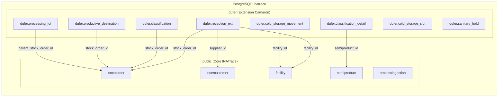
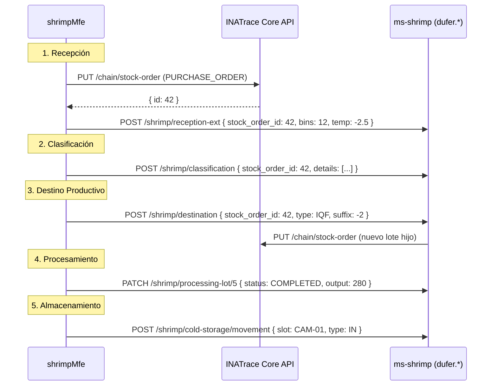

# Esquema de Extensión `inatrace.dufer` — Especificación de Modelo de Datos

> **Propósito**: Definir las tablas de extensión que complementan el Core de INATrace para el flujo de procesamiento de camarón de Empacadora Dufer Cia Ltda.
>
> **Principio**: El Core (`public.*`) NUNCA se modifica. Las tablas de `dufer.*` referencian entidades del Core vía FK y agregan campos específicos del negocio camaronero.

---

## Arquitectura de Esquemas



---

## 1. `dufer.reception_ext` — Extensión de Recepción

> Campos adicionales que no existen en `public.stockorder` pero son necesarios para la recepción de camarón.

| Columna | Tipo | Null | Default | Descripción |
|---|---|---|---|---|
| `id` | `BIGSERIAL` | NO | auto | PK |
| `stock_order_id` | `BIGINT` | NO | — | FK → `public.stockorder(id)` UNIQUE |
| `supplier_id` | `BIGINT` | SI | — | FK → `public.usercustomer(id)` — Redundante pero útil para queries rápidos |
| `bins_count` | `INTEGER` | NO | — | Cantidad de gavetas/bines |
| `reception_temperature_c` | `DECIMAL(5,2)` | SI | — | Temperatura del producto al ingreso (°C) |
| `vehicle_plate` | `VARCHAR(20)` | SI | — | Placa del vehículo de transporte |
| `driver_name` | `VARCHAR(150)` | SI | — | Nombre del conductor |
| `guide_number` | `VARCHAR(50)` | SI | — | Número de guía de remisión |
| `organoleptic_status` | `VARCHAR(20)` | NO | `'PENDING'` | Estado organoléptico: `PENDING`, `APPROVED`, `REJECTED` |
| `rejection_reason` | `TEXT` | SI | — | Motivo del rechazo (si aplica) |
| `photos_json` | `JSONB` | SI | — | URLs de fotos de evidencia |
| `created_at` | `TIMESTAMPTZ` | NO | `NOW()` | Fecha de creación |
| `updated_at` | `TIMESTAMPTZ` | NO | `NOW()` | Última actualización |
| `created_by` | `VARCHAR(100)` | SI | — | Usuario operador |

```sql
CREATE TABLE dufer.reception_ext (
    id              BIGSERIAL PRIMARY KEY,
    stock_order_id  BIGINT NOT NULL UNIQUE REFERENCES public.stockorder(id) ON DELETE CASCADE,
    supplier_id     BIGINT REFERENCES public.usercustomer(id),
    bins_count      INTEGER NOT NULL CHECK (bins_count > 0),
    reception_temperature_c DECIMAL(5,2),
    vehicle_plate   VARCHAR(20),
    driver_name     VARCHAR(150),
    guide_number    VARCHAR(50),
    organoleptic_status VARCHAR(20) NOT NULL DEFAULT 'PENDING'
        CHECK (organoleptic_status IN ('PENDING', 'APPROVED', 'REJECTED', 'ON_HOLD')),
    rejection_reason TEXT,
    photos_json     JSONB DEFAULT '[]'::jsonb,
    created_at      TIMESTAMPTZ NOT NULL DEFAULT NOW(),
    updated_at      TIMESTAMPTZ NOT NULL DEFAULT NOW(),
    created_by      VARCHAR(100)
);

CREATE INDEX idx_reception_ext_stock_order ON dufer.reception_ext(stock_order_id);
CREATE INDEX idx_reception_ext_created ON dufer.reception_ext(created_at DESC);
CREATE INDEX idx_reception_ext_status ON dufer.reception_ext(organoleptic_status);
```

---

## 2. `dufer.classification` — Cabecera de Clasificación

> Registra el resultado de la clasificación por tallas de un lote.

| Columna | Tipo | Null | Default | Descripción |
|---|---|---|---|---|
| `id` | `BIGSERIAL` | NO | auto | PK |
| `stock_order_id` | `BIGINT` | NO | — | FK → `public.stockorder(id)` — Lote de origen |
| `classified_at` | `TIMESTAMPTZ` | NO | `NOW()` | Fecha/hora de clasificación |
| `total_weight_lbs` | `DECIMAL(12,2)` | NO | — | Peso total clasificado |
| `reject_weight_lbs` | `DECIMAL(12,2)` | SI | `0` | Peso rechazado (a cola/descarte) |
| `reject_reason` | `VARCHAR(50)` | SI | — | `SIZE_TOO_SMALL`, `DAMAGED`, `OTHER` |
| `operator_name` | `VARCHAR(150)` | SI | — | Operador de clasificación |
| `quality_score` | `DECIMAL(3,1)` | SI | — | Puntuación de calidad 0-10 |
| `notes` | `TEXT` | SI | — | Observaciones |
| `created_by` | `VARCHAR(100)` | SI | — | Usuario operador |

```sql
CREATE TABLE dufer.classification (
    id                BIGSERIAL PRIMARY KEY,
    stock_order_id    BIGINT NOT NULL REFERENCES public.stockorder(id) ON DELETE CASCADE,
    classified_at     TIMESTAMPTZ NOT NULL DEFAULT NOW(),
    total_weight_lbs  DECIMAL(12,2) NOT NULL,
    reject_weight_lbs DECIMAL(12,2) DEFAULT 0,
    reject_reason     VARCHAR(50),
    operator_name     VARCHAR(150),
    quality_score     DECIMAL(3,1) CHECK (quality_score BETWEEN 0 AND 10),
    notes             TEXT,
    created_by        VARCHAR(100)
);

CREATE INDEX idx_classification_stock_order ON dufer.classification(stock_order_id);
```

---

## 3. `dufer.classification_detail` — Detalle por Talla

> Distribución porcentual del peso por cada talla de camarón.

| Columna | Tipo | Null | Default | Descripción |
|---|---|---|---|---|
| `id` | `BIGSERIAL` | NO | auto | PK |
| `classification_id` | `BIGINT` | NO | — | FK → `dufer.classification(id)` |
| `semiproduct_id` | `BIGINT` | SI | — | FK → `public.semiproduct(id)` — Talla específica |
| `size_code` | `VARCHAR(20)` | NO | — | Código talla: `U10`, `U12`, `16_20`, `21_25`, `26_30`, etc. |
| `weight_lbs` | `DECIMAL(12,2)` | NO | — | Peso en Lbs para esta talla |
| `percentage` | `DECIMAL(5,2)` | SI | — | % del total clasificado |
| `count_per_lb` | `INTEGER` | SI | — | Conteo de camarones por libra (para validar talla) |

```sql
CREATE TABLE dufer.classification_detail (
    id                  BIGSERIAL PRIMARY KEY,
    classification_id   BIGINT NOT NULL REFERENCES dufer.classification(id) ON DELETE CASCADE,
    semiproduct_id      BIGINT REFERENCES public.semiproduct(id),
    size_code           VARCHAR(20) NOT NULL,
    weight_lbs          DECIMAL(12,2) NOT NULL CHECK (weight_lbs >= 0),
    percentage          DECIMAL(5,2) CHECK (percentage BETWEEN 0 AND 100),
    count_per_lb        INTEGER CHECK (count_per_lb > 0)
);

CREATE INDEX idx_class_detail_class ON dufer.classification_detail(classification_id);
```

---

## 4. `dufer.productive_destination` — Decisión de Destino

> Registra a qué línea productiva se asigna cada fracción del lote.

| Columna | Tipo | Null | Default | Descripción |
|---|---|---|---|---|
| `id` | `BIGSERIAL` | NO | auto | PK |
| `stock_order_id` | `BIGINT` | NO | — | FK → `public.stockorder(id)` — Lote base |
| `destination_type` | `VARCHAR(20)` | NO | — | `BLOQUE`, `IQF`, `VALOR_AGREGADO`, `SALMUERA` |
| `lot_suffix` | `VARCHAR(10)` | NO | — | Sufijo: `""`, `"-2"`, `"-3"`, `"-4"` |
| `derived_lot_number` | `VARCHAR(50)` | NO | — | Lote completo derivado (ej: `270326-001-2`) |
| `weight_lbs` | `DECIMAL(12,2)` | NO | — | Peso asignado a este destino |
| `assigned_at` | `TIMESTAMPTZ` | NO | `NOW()` | Fecha de asignación |
| `assigned_by` | `VARCHAR(100)` | SI | — | Jefe de planta que decidió |
| `child_stock_order_id` | `BIGINT` | SI | — | FK → `public.stockorder(id)` — StockOrder hijo (cuando se cree vía Processing) |

```sql
CREATE TABLE dufer.productive_destination (
    id                    BIGSERIAL PRIMARY KEY,
    stock_order_id        BIGINT NOT NULL REFERENCES public.stockorder(id) ON DELETE CASCADE,
    destination_type      VARCHAR(20) NOT NULL
        CHECK (destination_type IN ('BLOQUE', 'IQF', 'VALOR_AGREGADO', 'SALMUERA')),
    lot_suffix            VARCHAR(10) NOT NULL,
    derived_lot_number    VARCHAR(50) NOT NULL,
    weight_lbs            DECIMAL(12,2) NOT NULL CHECK (weight_lbs > 0),
    assigned_at           TIMESTAMPTZ NOT NULL DEFAULT NOW(),
    assigned_by           VARCHAR(100),
    child_stock_order_id  BIGINT REFERENCES public.stockorder(id)
);

CREATE INDEX idx_prod_dest_stock_order ON dufer.productive_destination(stock_order_id);
CREATE INDEX idx_prod_dest_type ON dufer.productive_destination(destination_type);
CREATE UNIQUE INDEX idx_prod_dest_lot ON dufer.productive_destination(derived_lot_number);
```

---

## 5. `dufer.processing_lot` — Lote en Procesamiento

> Registra el estado de un sub-lote dentro de la línea de procesamiento específica.

| Columna | Tipo | Null | Default | Descripción |
|---|---|---|---|---|
| `id` | `BIGSERIAL` | NO | auto | PK |
| `productive_destination_id` | `BIGINT` | NO | — | FK → `dufer.productive_destination(id)` |
| `parent_stock_order_id` | `BIGINT` | NO | — | FK → `public.stockorder(id)` — Lote padre |
| `processing_type` | `VARCHAR(30)` | NO | — | `EMPAQUE_BLOQUES`, `IQF_FUNDAS`, `PPV`, `PND`, `EZ_PEEL`, `SALMUERA` |
| `input_weight_lbs` | `DECIMAL(12,2)` | NO | — | Peso de entrada |
| `output_weight_lbs` | `DECIMAL(12,2)` | SI | — | Peso de salida (rendimiento) |
| `packaging_type` | `VARCHAR(30)` | SI | — | `BLOCK_5LB`, `BAG_2LB`, `TRAY_1LB`, `BUCKET_5GAL` |
| `units_produced` | `INTEGER` | SI | — | Cantidad de cajas/fundas/bandejas producidas |
| `yield_percentage` | `DECIMAL(5,2)` | SI | — | % rendimiento = output/input × 100 |
| `started_at` | `TIMESTAMPTZ` | SI | — | Inicio del procesamiento |
| `completed_at` | `TIMESTAMPTZ` | SI | — | Fin del procesamiento |
| `status` | `VARCHAR(20)` | NO | `'PENDING'` | `PENDING`, `IN_PROGRESS`, `COMPLETED`, `ON_HOLD` |
| `operator_name` | `VARCHAR(150)` | SI | — | Operador de línea |

```sql
CREATE TABLE dufer.processing_lot (
    id                        BIGSERIAL PRIMARY KEY,
    productive_destination_id BIGINT NOT NULL REFERENCES dufer.productive_destination(id) ON DELETE CASCADE,
    parent_stock_order_id     BIGINT NOT NULL REFERENCES public.stockorder(id),
    processing_type           VARCHAR(30) NOT NULL
        CHECK (processing_type IN ('EMPAQUE_BLOQUES','IQF_FUNDAS','PPV','PND','EZ_PEEL','SALMUERA')),
    input_weight_lbs          DECIMAL(12,2) NOT NULL,
    output_weight_lbs         DECIMAL(12,2),
    packaging_type            VARCHAR(30),
    units_produced            INTEGER,
    yield_percentage          DECIMAL(5,2),
    started_at                TIMESTAMPTZ,
    completed_at              TIMESTAMPTZ,
    status                    VARCHAR(20) NOT NULL DEFAULT 'PENDING'
        CHECK (status IN ('PENDING','IN_PROGRESS','COMPLETED','ON_HOLD')),
    operator_name             VARCHAR(150)
);

CREATE INDEX idx_proc_lot_dest ON dufer.processing_lot(productive_destination_id);
CREATE INDEX idx_proc_lot_status ON dufer.processing_lot(status);
```

---

## 6. `dufer.cold_storage_slot` — Cámaras de Almacenamiento

> Define las cámaras frigoríficas y su configuración.

| Columna | Tipo | Null | Default | Descripción |
|---|---|---|---|---|
| `id` | `BIGSERIAL` | NO | auto | PK |
| `facility_id` | `BIGINT` | NO | — | FK → `public.facility(id)` — "Cámara Frigorífica" |
| `slot_code` | `VARCHAR(20)` | NO | — | Código: `CAM-01`, `CAM-02`, etc. |
| `slot_name` | `VARCHAR(100)` | NO | — | "Cámara de Mantenimiento 1" |
| `target_temperature_c` | `DECIMAL(5,2)` | NO | `-18.00` | Temperatura objetivo |
| `max_capacity_lbs` | `DECIMAL(12,2)` | SI | — | Capacidad máxima en Lbs |
| `is_active` | `BOOLEAN` | NO | `true` | ¿Está operativa? |

```sql
CREATE TABLE dufer.cold_storage_slot (
    id                    BIGSERIAL PRIMARY KEY,
    facility_id           BIGINT NOT NULL REFERENCES public.facility(id),
    slot_code             VARCHAR(20) NOT NULL UNIQUE,
    slot_name             VARCHAR(100) NOT NULL,
    target_temperature_c  DECIMAL(5,2) NOT NULL DEFAULT -18.00,
    max_capacity_lbs      DECIMAL(12,2),
    is_active             BOOLEAN NOT NULL DEFAULT true
);
```

---

## 7. `dufer.cold_storage_movement` — Movimientos FIFO en Cámaras

> Registra entradas y salidas de producto terminado en cámaras, respetando FIFO.

| Columna | Tipo | Null | Default | Descripción |
|---|---|---|---|---|
| `id` | `BIGSERIAL` | NO | auto | PK |
| `cold_storage_slot_id` | `BIGINT` | NO | — | FK → `dufer.cold_storage_slot(id)` |
| `processing_lot_id` | `BIGINT` | NO | — | FK → `dufer.processing_lot(id)` |
| `movement_type` | `VARCHAR(10)` | NO | — | `IN` o `OUT` |
| `weight_lbs` | `DECIMAL(12,2)` | NO | — | Peso movido |
| `units_count` | `INTEGER` | SI | — | Cajas/fundas movidas |
| `temperature_c` | `DECIMAL(5,2)` | SI | — | Temperatura al momento del movimiento |
| `moved_at` | `TIMESTAMPTZ` | NO | `NOW()` | Fecha/hora del movimiento |
| `moved_by` | `VARCHAR(100)` | SI | — | Operador |
| `destination_notes` | `VARCHAR(255)` | SI | — | Ej: "Despacho contenedor #45892" |

```sql
CREATE TABLE dufer.cold_storage_movement (
    id                    BIGSERIAL PRIMARY KEY,
    cold_storage_slot_id  BIGINT NOT NULL REFERENCES dufer.cold_storage_slot(id),
    processing_lot_id     BIGINT NOT NULL REFERENCES dufer.processing_lot(id),
    movement_type         VARCHAR(10) NOT NULL CHECK (movement_type IN ('IN', 'OUT')),
    weight_lbs            DECIMAL(12,2) NOT NULL,
    units_count           INTEGER,
    temperature_c         DECIMAL(5,2),
    moved_at              TIMESTAMPTZ NOT NULL DEFAULT NOW(),
    moved_by              VARCHAR(100),
    destination_notes     VARCHAR(255)
);

CREATE INDEX idx_cs_movement_slot ON dufer.cold_storage_movement(cold_storage_slot_id);
CREATE INDEX idx_cs_movement_lot ON dufer.cold_storage_movement(processing_lot_id);
CREATE INDEX idx_cs_movement_date ON dufer.cold_storage_movement(moved_at DESC);
```

---

## 8. `dufer.sanitary_hold` — Retenciones Sanitarias

> Registra retenciones sanitarias de lotes completos o parciales.

| Columna | Tipo | Null | Default | Descripción |
|---|---|---|---|---|
| `id` | `BIGSERIAL` | NO | auto | PK |
| `stock_order_id` | `BIGINT` | NO | — | FK → `public.stockorder(id)` |
| `hold_type` | `VARCHAR(20)` | NO | — | `MICROBIOLOGICAL`, `CHEMICAL`, `PHYSICAL`, `OTHER` |
| `hold_reason` | `TEXT` | NO | — | Descripción detallada |
| `held_at` | `TIMESTAMPTZ` | NO | `NOW()` | Fecha de retención |
| `held_by` | `VARCHAR(100)` | NO | — | Responsable de calidad |
| `released_at` | `TIMESTAMPTZ` | SI | — | Fecha de liberación (null = activo) |
| `released_by` | `VARCHAR(100)` | SI | — | Quién liberó |
| `release_notes` | `TEXT` | SI | — | Notas de liberación |
| `lab_report_url` | `VARCHAR(500)` | SI | — | URL al informe de laboratorio |

```sql
CREATE TABLE dufer.sanitary_hold (
    id              BIGSERIAL PRIMARY KEY,
    stock_order_id  BIGINT NOT NULL REFERENCES public.stockorder(id),
    hold_type       VARCHAR(20) NOT NULL
        CHECK (hold_type IN ('MICROBIOLOGICAL', 'CHEMICAL', 'PHYSICAL', 'OTHER')),
    hold_reason     TEXT NOT NULL,
    held_at         TIMESTAMPTZ NOT NULL DEFAULT NOW(),
    held_by         VARCHAR(100) NOT NULL,
    released_at     TIMESTAMPTZ,
    released_by     VARCHAR(100),
    release_notes   TEXT,
    lab_report_url  VARCHAR(500)
);

CREATE INDEX idx_sanitary_hold_active ON dufer.sanitary_hold(stock_order_id) WHERE released_at IS NULL;
```

---

## Flujo de Datos Completo



---

## Enums Propuestos (para TypeORM/NestJS)

```typescript
// Archivo: ms-shrimp/src/enums/

export enum OrganolepticStatus {
  PENDING = 'PENDING',
  APPROVED = 'APPROVED',
  REJECTED = 'REJECTED',
  ON_HOLD = 'ON_HOLD'
}

export enum DestinationType {
  BLOQUE = 'BLOQUE',
  IQF = 'IQF',
  VALOR_AGREGADO = 'VALOR_AGREGADO',
  SALMUERA = 'SALMUERA'
}

export enum ProcessingType {
  EMPAQUE_BLOQUES = 'EMPAQUE_BLOQUES',
  IQF_FUNDAS = 'IQF_FUNDAS',
  PPV = 'PPV',
  PND = 'PND',
  EZ_PEEL = 'EZ_PEEL',
  SALMUERA = 'SALMUERA'
}

export enum ProcessingStatus {
  PENDING = 'PENDING',
  IN_PROGRESS = 'IN_PROGRESS',
  COMPLETED = 'COMPLETED',
  ON_HOLD = 'ON_HOLD'
}

export enum MovementType {
  IN = 'IN',
  OUT = 'OUT'
}

export enum HoldType {
  MICROBIOLOGICAL = 'MICROBIOLOGICAL',
  CHEMICAL = 'CHEMICAL',
  PHYSICAL = 'PHYSICAL',
  OTHER = 'OTHER'
}
```

---

## Notas para Implementación del Microservicio

> [!IMPORTANT]
> **Nombre del microservicio**: `ms-shrimp`
> **Framework**: NestJS + TypeORM (igual que el resto de microservicios IXO)
> **Schema**: `inatrace.dufer` (ya existe en PostgreSQL)
> **Puerto**: A definir (ej: 3020)

> [!TIP]
> **Patrón de comunicación**: El `ms-shrimp` se comunica con el Core vía HTTP REST (no Redis RPC), ya que el Core es Java/Spring Boot y no participa en el bus de mensajes NestJS.

> [!WARNING]
> Las FK hacia `public.stockorder`, `public.facility`, etc. crean un acoplamiento a nivel de DB. Si el Core modifica IDs (ej: al hacer migrations con TRUNCATE CASCADE), las tablas de `dufer.*` también se verían afectadas. Considerar soft-references (guardar IDs sin FK explícita) como alternativa.
